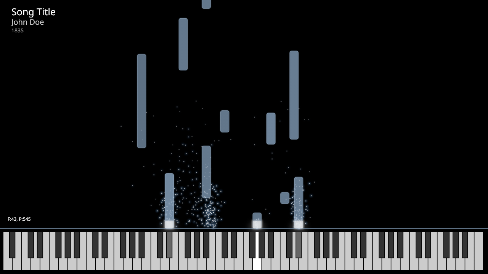

# MIDIC 
C++ MIDI recorder and visualizer




### Install:

* Optional `ffmpeg` (to build video)
* Optional `fluidsynth` (to generate wave file from midi)


```shell
mkdir build
cd build
cmake ..
make
```

### Usage:

* Record an instrument
  ```shell
  ./midic_rec [<output raw file>]
  ```
* Generate video
  ```shell
  ./midic_raster [-c <config file>] <raw file>
  ``` 
* Tools (planned)
  ```shell
  #./midic_trim <input raw file> [<output raw file>]
  #./midic_quantize <input raw file> [<output raw file>]
  ```
  
-----

### TODO

* [ ] display velocity (alpha + glow)
* [ ] create midic_trim
* [ ] create midic_midi
* [ ] create midic_quantize  