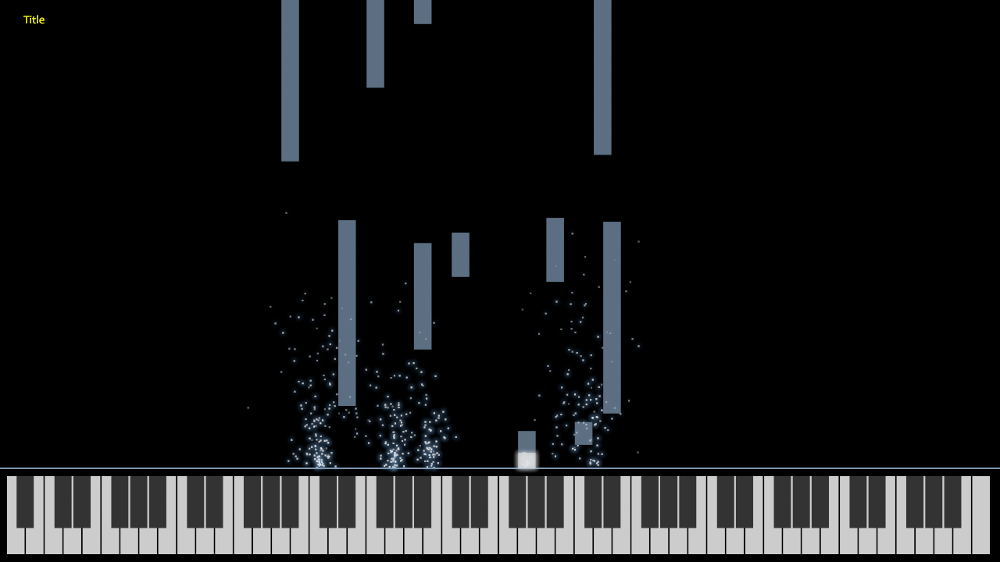

# MIDIC 
C++ MIDI recorder and visualizer




Install:

Requirements:

* `ffmpeg` to be installed.

```shell
mkdir build
cd build
cmake ..
make
```

Usage:

* Record the instrument
  ```shell
  ./midic
  ```
* Generate video
  ```shell
  ./midic_raster <raw file> <config file>
  ``` 